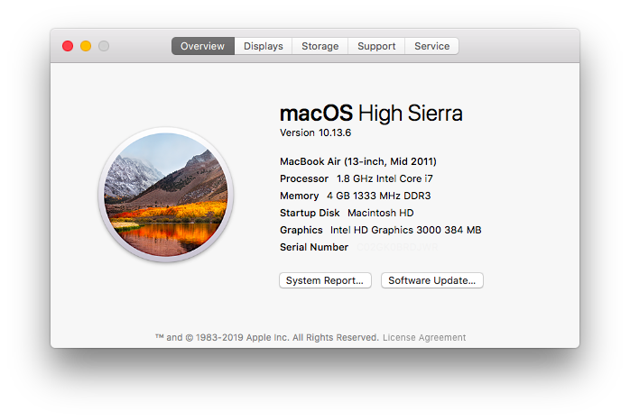

# はじめに
このサンプルでは、[PlantUML](http://plantuml.com) を使って GitBook に `UML` を記述する方法を説明します。

GitBook で利用できる PlantUML のプラグインは、いくつか公開されています。  
残念ながら、私が導入して調べた限りでは、[GitBook Plugins](https://plugins.gitbook.com) に登録されているプラグインはどれも難点がありました。

[gitbook-plugin-uml](https://github.com/vowstar/gitbook-plugin-uml) をインストールします。

## PlantUMLの準備
GitBookで [PlantUML](http://plantuml.com) を使えるようにするために先ずは、 
つぎのコマンドを実行して `gitbook-plugin-uml` をインストールします。

```shell
$ yarn add gitbook-plugin-uml
```

## GitBookの設定
`book.json` に、つぎの記述を行います。

```json
{
  "plugins": [
    "uml"
  ],
  "pluginsConfig": {
    "uml": {
    "charset": "utf-8",
    "format": "svg"
    }
  }
}
```

`pluginsConfig` に、文字コードと画像フォーマットの指定を行います。  
文字コードの指定を行なわないと生成される UML の文字が化けます。  
画像フォーマットは `png` も指定できますが、　`svg` 形式なら、拡大してもキレイな画像になります。

続いて、つぎのコマンドを実行して `uml` プラグインをインストールします。

```shell
$ gitbook install
```

## UMLの記述
UMLの記述は、つぎのふた通りが選べます。

- Markdownファイル内に記述
- 別ファイルで記述

一長一短ありますので、状況に応じて選択してください。

### インライン記述
Markdownファイル内に記述する方法です。  

| メリット | デメリット |
|:-- |:-- |
| 内部に記述するので、一元管理できます | 要素が増えると縦に長くなる |
| UMLの記述ルールがわかれば、想像できます | 共通設定等を別ファイにできない |


### 外部ファイルで記述
別ファイルで記述して、取り込む方法です。

| メリット | デメリット |
|:-- |:-- |
| Markdownの記述がスッキリする | ファイルの管理が煩雑になる |
| 他への流用が楽 | 更新対象ファイルから外れている |

```puml { src="ja/uml/sample-screen.pu" }
```

## 折りたたみ
折りたたみ(collapse)は、
長いソースや画像を通常は表示せずに折りたたんで置く場合の方法です。  
次の二つの方法があります。  

- HTMLタグを記述する
- collapseプラグインを使う

### HTMLタグ記述
**Markdown** の標準記法には定義されていません。が **Markdown** は **HTML** を簡単に記述する記法なので定義されていない機能は HTMLタグを直接記述することで実現できます。  

`<details>` タグを利用します。次のように記述します。

```html
<details><summary>About This Mac</summary>

</details>
```

折りたたむ中身の記述も **HTML** で記述します。

<details><summary>About This Mac</summary>

</details>

こちらの方法の場合、Atom の markdown-preview で折りたたまれます。

### collapseプラグイン
`book.json` の `"plugins"` に `"collapse"` を追加し

```json
{
  "plugins": [
    "collapse"
  ],
}
```

```shell
$ gitbook install
```

を行い、折りたたみたい箇所に次のように記述します。

```



```





折りたたむ中身も **Markdown** 記法で記述できます。  
Atom の markdown-preview では、当たり前ですが折り畳まれません。

## おわりに
[APPENDIX](./APPENDIX.md) に

- ファビコンの変更
- ロゴ画像の挿入
- 多言語
- その他

について記述してあります。
